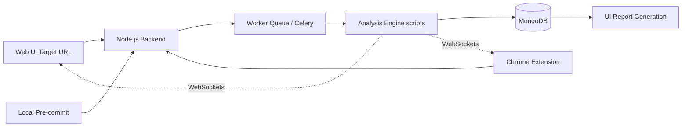

# Lightweight Vulnerability Scanner Dashboard

## The Problem

In fast-paced development cycles, code is frequently pushed without adequate verification of basic security misconfigurations. Identifying outdated dependencies, missing security headers, or basic injection vectors retroactively is costly and dangerous.

## The Solution

An automated, multi-entrypoint security scanning ecosystem designed to shift-left vulnerability detection. This tool provides a seamless developer experience by integrating directly into existing workflows via a Web Dashboard, a Chrome Extension, and a local CLI Pre-commit hook.

The system scans target URLs or codebases and outputs clean, visually appealing risk classification reports, ensuring enterprise-grade security practices are accessible for all projects.

---

## High-Level Architecture and Data Flow

The system is designed with a distributed architecture to handle concurrent, intensive scanning without blocking the main web server.

